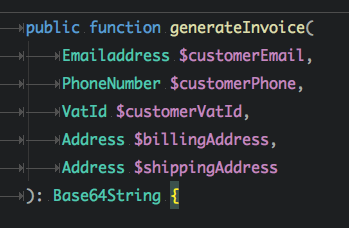

# SmartEmailing \ Types 

### Missing data types for PHP 7.1. Highly extendable, production tested.

[](https://lbesson.mit-license.org/)
[](https://github.com/smartemailing/types/releases/)
[](https://packagist.org/packages/smartemailing/types)

[](https://circleci.com/gh/smartemailing/types)
[](https://codecov.io/gh/smartemailing/types)
[](https://codeclimate.com/github/smartemailing/types/maintainability)


Neverending data validation can be exhausting. Either you have to validate your data 
over and over again in every function you use it, or you have to rely 
it has already been validated somewhere else and risk potential problems. 

Smelly, right?

Replacing validation hell with **Types** will make 
your code much more readable and less vulnerable to bugs.

**Types** wrap your data in value objects that are guaranteed to be 
**valid and normalized; or not to exist at all**. 
It allows you to use specific type hints instead of primitive types or arrays.
Your code will be unbreakable and your IDE will love it.




## Table of Contents

  * [Installation](#installation)
  * [How does it work](#how-does-it-work)
    + [Wrapping raw value](#wrapping-raw-value)
    + [Extraction from array](#extraction-from-array)
  * [String-extractable types](#string-extractable-types)
    + [E-mail address](#e-mail-address)
    + [Domain](#domain)
    + [Hex 32](#hex-32)
    + [Hex Color](#hex-color)
    + [GUID](#guid)
    + [IP address](#ip-address)
    + [URL](#url)
    + [Company registration number](#company-registration-number)
    + [Phone number](#phone-number)
    + [ZIP code](#zip-code)
    + [JSON](#json)
    + [Base 64](#base-64)
    + [Iban](#iban)
    + [SwiftBic](#swiftbic)
    + [VatId](#vatid)
    + [CurrencyCode](#currencycode)
    + [CountryCode](#countrycode)
  * [Int-extractable types](#int-extractable-types)
    + [Port](#port)
    + [Quantity](#quantity)
    + [Unsigned Integer](#unsigned-integer)
  * [Float-extractable types](#float-extractable-types)
    + [Part](#part)
    + [Sigmoid function value](#sigmoid-function-value)
    + [Rectified Linear Unit function value](#rectified-linear-unit-function-value)
  * [Array-extractable types](#array-extractable-types)
    + [DateTimeRange](#datetimerange)
    + [Duration](#duration)
    + [Address](#address)
    + [Price](#price)
    + [Login credentials](#login-credentials)
  * [Array-types](#array-types)
    + [UniqueIntArray](#uniqueintarray)
    + [UniqueStringArray](#uniquestringarray)
  * [Enum-extractable types](#enum-extractable-types)
    + [Lawful Basis For Processing](#lawful-basis-for-processing)
    + [Country code](#country-code)
    + [Currency code](#currency-code)
    + [Field of Application](#field-of-application)
    + [Time unit](#time-unit)
    + [Relation](#relation)
  * [Primitive types](#primitive-types-and-arrays)
  * [DateTimes](#datetimes)
  * [Writing your own types](#writing-your-own-types)
  * [How to contribute](#how-to-contribute)

## Installation

The recommended way to install is via Composer:

```
composer require smartemailing/types
```

## How does it work

It is easy. You just initialize desired value object by simple one-liner. 
From this point, you have sanitized, normalized and valid data; or `SmartEmailing\Types\InvalidTypeException` to handle.

**Types** consist from:

- String-extractable types - validated strings (E-mail address, Domains, Hexadecimal strings, ...)
- Int-extractable types - validated integers (Port) 
- Float-extractable types - validated floats (SigmoidValue, Part, ...) 
- Enum-extractable types - enumerables (CountryCode, CurrencyCode, GDPR's Lawful purpose, ...)
- Composite (Array-extractable) types - structures containing multiple another types (Address, ...)
- DateTimes - extraction of DateTime and DateTimeImmutable
- Primitive types extractors and unique arrays

Different types provide different methods related to them, but all types share this extraction API:

### Wrapping raw value

```php
<?php

declare(strict_types = 1);

use SmartEmailing\Types\Emailaddress;
use SmartEmailing\Types\InvalidTypeException;

// Valid input

$emailaddress = Emailaddress::from('hello@gmail.com'); // returns Emailaddress object
$emailaddress = Emailaddress::from($emailaddress); // returns original $emailaddress

// Invalid input

$emailaddress = Emailaddress::from('bla bla'); // throws InvalidTypeException
$emailaddress = Emailaddress::from(1); // throws InvalidTypeException
$emailaddress = Emailaddress::from(false); // throws InvalidTypeException
$emailaddress = Emailaddress::from(null); // throws InvalidTypeException
$emailaddress = Emailaddress::from([]); // throws InvalidTypeException
$emailaddress = Emailaddress::from(new \StdClass()); // throws InvalidTypeException

// Nullables

$emailaddress = Emailaddress::fromOrNull(null); // returns NULL
$emailaddress = Emailaddress::fromOrNull('bla bla'); // throws InvalidTypeException
$emailaddress = Emailaddress::fromOrNull('bla bla', true); // returns null instead of throwing

```

### Extraction from array

This is really useful for strict-typing (validation) multidimensional arrays like API requests, forms or database data.

```php
<?php

use SmartEmailing\Types\Emailaddress;
use SmartEmailing\Types\InvalidTypeException;

$input = [
	'emailaddress' => 'hello@gmail.com',
	'already_types_emailaddress' => Emailaddress::from('hello2@gmail.com'),
	'invalid_data' => 'bla bla',
];

// Valid input

$emailaddress = Emailaddress::extract($input, 'emailaddress'); // returns Emailaddress object
$emailaddress = Emailaddress::extract($input, 'already_types_emailaddress'); // returns original Emailaddress object

// Invalid input

$emailaddress = Emailaddress::extract($input, 'invalid_data'); // throws InvalidTypeException
$emailaddress = Emailaddress::extract($input, 'not_existing_key'); // throws InvalidTypeException

// Nullables 

$emailaddress = Emailaddress::extractOrNull($input, 'not_existing_key'); // returns null
$emailaddress = Emailaddress::extractOrNull($input, 'invalid_data'); //  throws InvalidTypeException
$emailaddress = Emailaddress::extractOrNull($input, 'invalid_data', true); // returns null instead of throwing

// Default values
$emailaddress 
	= Emailaddress::extractOrNull($input, 'not_existing_key') 
	?? Emailaddress::from('default@domain.com'); 
	// uses null coalescing operator to assign default value if key not present or null

$emailaddress 
	= Emailaddress::extractOrNull($input, 'not_existing_key', true) 
	?? Emailaddress::from('default@domain.com'); 
	// uses null coalescing operator to assign default value if key not present or null or invalid


```

## String-extractable types

String-extractable types are based on validated strings. All values are trimmed before validation.

They can be easily converted back to string by string-type casting or calling `$type->getValue()`.

### E-mail address

`SmartEmailing\Types\Emailaddress`

Lowercased and ASCII-transformed e-mail address (`hello@gmail.com`)

Type-specific methods:
- `getLocalPart() : string` returns local part of e-mail address (`hello`)
- `getDomain() : \SmartEmailing\Types\Domain` returns domain part (`gmail.com`, represented as `Types\Domain`)

### Domain

`SmartEmailing\Types\Domain`

Lowercased domain name (`mx1.googlemx.google.com`)

Type-specific methods:
- `getSecondLevelDomain() : \SmartEmailing\Types\Domain` returns second-level domain. (`google.com`)


### Hex 32

`SmartEmailing\Types\Hex32`

Lowercased 32-characters long hexadecimal string useful as container for MD5 or UUID without dashes. (`741ecf779c9244358e6b85975bd13452`)

### Hex color

`SmartEmailing\Types\HexColor`

Uppercased 7-characters long string useful as container for color. (`#006EDB`)


### GUID

`SmartEmailing\Types\Guid`

Lowercased Guid with dashes (`741ecf77-9c92-4435-8e6b-85975bd13452`)

### IP address

`SmartEmailing\Types\IpAddress`

IP address v4 or v6. (`127.0.0.1`, `[2001:0db8:0a0b:12f0:0000:0000:0000:0001]`, `2001:db8:a0b:12f0::1`)

Type-specific methods:
- `getVersion() : int` returns IP address version, `4` or `6`

### URL

`SmartEmailing\Types\UrlType`

URL based on `Nette\Http\Url` (`https://www.google.com/search?q=all+work+and+no+play+makes+jack+a+dull+boy`)

- all spaces in string are urlencoded
- all non-ascii characters are urlencoded

Type-specific methods:
- `getAuthority() : string` returns authority (`www.google.com`)
- `getHost() : string` returns Host (`www.google.com`)
- `getQueryString() : string` returns Query string (`q=all%20work%20and%20no%20play%20makes%20jack%20a%20dull%20boy`)
- `getPath() : string` returns URl Path (`/search`)
- `getAbsoluteUrl() : string` Complete URL as `string`, alias for `getValue()` 
- `getQueryParameter(string $name, mixed $default = null): mixed` Return value of parameter `$name`
- `getBaseUrl(): string` Return URL without path, query string and hash part (`https://www.google.cz/`)
- `getScheme(): string` Return URL scheme (`https`)
- `hasParameters(string[] $names): bool` Returns `true` if URL parameters contain all parameters defined in `$names` array
- `getParameters(): array` Returns all URL parameters as string-indexed array
- `withQueryParameter(string $name, mixed $value): UrlType` Returns new instance with added query parameter.

### Company registration number

`SmartEmailing\Types\CompanyRegistrationNumber`

Whitespace-free company registration number for following countries: 
`CZ`, `SK`, `CY`

### Phone number

`SmartEmailing\Types\PhoneNumber`

Whitespace-free phone number in international format for following countries: 
`CZ`, `SK`, `AT`, `BE`, `FR`, `HU`, `GB`, `DE`, `US`, `PL`, `IT`, `SE`, `SI`, `MH`, `NL`, `CY`, `IE`, `DK`, `FI`, `LU`, `TR`

Type-specific methods:
- `getCountry() : SmartEmailing\Types\CountryCode` Originating country (`CZ`)


### ZIP code

`SmartEmailing\Types\ZipCode`

Whitespace-free ZIP code valid in following countries: 
`CZ`, `SK`, `UK`, `US`


### JSON

`SmartEmailing\Types\JsonString`

Valid JSON-encoded data as string

Type-specific methods:
- `static from(mixed $data) : SmartEmailing\Types\JsonString` Accepts string or array. Crates JsonString from valid json string or raw data (array)
- `static encode(mixed $data) : SmartEmailing\Types\JsonString` create JsonString from raw data (array)
- `getDecodedValue() : mixed` decode JsonString back to raw data

### Base 64

`SmartEmailing\Types\Base64String`

Valid Base 64-encoded data as string

Type-specific methods:
- `static encode(string $value) : SmartEmailing\Types\Base64String` create Base64String from string
- `getDecodedValue() : string` decode Base64String back to original string


### Iban

`SmartEmailing\Types\Iban`

Type-specific methods:
- `getFormatted(string $type = SmartEmailing\Types\Iban::FORMAT_ELECTRONIC): string` returns formatted Iban string. Format types: `FORMAT_ELECTRONIC`, `FORMAT_PRINT`.
- `getCountry(): SmartEmailing\Types\CountryCode`
- `getChecksum(): int` 

### SwiftBic

`SmartEmailing\Types\SwiftBic`

Valid Swift/Bic codes.

### VatId
`SmartEmailing\Types\VatId`

Type-specific methods:
- `static isValid(string $vatId): bool` returns true if the vat id is valid otherwise returns false
- `getCountry(): ?Country` returns `Country` under which the subject should falls or null.
- `getPrefix(): ?string` returns string that prefixing vat id like `EL` from `EL123456789` or null.
- `getVatNumber(): string` returns vat number without prefix like `123456789`
- `getValue(): string` return whole vat id `EL123456789`

### CurrencyCode
`SmartEmailing\Types\CurrencyCode` 

Valid currency codes by ISO 4217

### CountryCode
`SmartEmailing\Types\CountryCode`

Valid country codes by ISO 3166-1 alpha-2


## Int-extractable types

Int-extractable types are based on validated integers.

They can be easily converted back to int by int-type casting or calling `$type->getValue()`.

### Port

`SmartEmailing\Types\Port`

Port number

Integer interval, `<0, 65535>`

### Quantity

`SmartEmailing\Types\Quantity`

Quantity of items

Integer interval, `<1, PHP_INT_MAX>`

### Unsigned Integer

`SmartEmailing\Types\UnsignedInt`

Usigned integer

Integer interval, `<0, PHP_INT_MAX>`

## Float-extractable types

Float-extractable types are based on validated floats.

They can be easily converted back to float by float-type casting or calling `$type->getValue()`.

### Part

`SmartEmailing\Types\Part`

Portion of the whole

Float interval `<0.0, 1.0>`

Type-specific methods:
- `static fromRatio(float $value, float $whole): Part` creates new instance by division `$value` and `$whole`.
-  `getPercent(): float` returns `(Ratio's value) * 100` to get percent representation

### Sigmoid function value

`SmartEmailing\Types\SigmoidValue`

Result of Sigmoid function, useful when building neural networks.

Float interval `<-1.0, 1.0>`. 

### Rectified Linear Unit function value

`SmartEmailing\Types\ReLUValue`

Result of Rectified Linear Unit function, useful when building neural networks.

Float interval `<0.0, Infinity)`. 


## Array-extractable types

Array-extractable types are composite types encapsulating one or more another types.
They are created from associative array. All Array-extractable types implement method 
`toArray() : array` which returns normalized array or type's data.

### DateTimeRange

`SmartEmailing\Types\DateTimeRange`

Range between two `\DateTimeInterface`s. Safe for datetimes out of range of unix timestamp.

Can be created from:

```php
DateTimeRange::from(
	[
		'from' => 'YYYY-MM-DD HH:MM:SS',
		'to' => 'YYYY-MM-DD HH:MM:SS',
	]
)
```
Type-specific methods:
- `getFrom(): \DateTimeImmutable` returns `From` date and time as `\DateTimeImmutable` instance
- `getTo(): \DateTimeImmutable` returns `To` date and time as `\DateTimeImmutable` instance
- `getDurationInSeconds(): int` returns number of seconds between `From` and `To` dates
- `contains(\DateTimeInterface $dateTime): bool` returns `true` if provided `\DateTimeInterface` lies between `From` and `To` dates.
- `getLengthInSeconds(): int` returns duration length in seconds

### Duration

`SmartEmailing\Types\Duration`

Human-readable time interval.

Can be created from:

```php
Duration::from(
	[
		'value' => 1,
		'unit' => TimeUnit::HOURS,
	]
);
```
Type-specific methods:
- `getDateTimeModify(): string` returns string that is compatible with `\DateTime::modify()` and `\DateTimeImmutable::modify()`
- `getUnit(): TimeUnit` returns `TimeUnit` enum type
- `getValue() int` returns number of units
- `static fromDateTimeModify(string $dateTimeModify): self` creates new instance from string compatible with `\DateTime::modify()` and `\DateTimeImmutable::modify()`


### Address

`SmartEmailing\Types\Address`

Location address cotaining street and number, town, zip code and country.

Can be created from:

```php
Address::from(
	[
		'street_and_number' => '29 Neibolt Street',
		'town' => 'Derry',
		'zip_code' => '03038',
		'country' => 'US',
	]
);
```
Type-specific methods:
- `getStreetAndNumber(): string` returns street and number
- `getTown(): string` returns Town
- `getZipCode(): ZipCode` returns ZipCode instance
- `getCountry(): CountryCode` returns CountryCode instance

### Price

`SmartEmailing\Types\Price`

Price object containing number of currency units with VAT, number of currency units without VAT and currency.

Can be created from:

```php
Price::from(
	[
		'with_vat' => 432.1,
		'without_vat' => 123.45,
		'currency' => CurrencyCode::EUR,
	]
);
```
Type-specific methods:
- `getWithoutVat(): float` returns price without VAT
- `getWithVat(): float` returns price with VAT
- `getCurrency(): CurrencyCode` returns CurrencyCode instance

### Login credentials

`SmartEmailing\Types\LoginCredentials`

Value object containing login and *plain* password. 
You should use it just in-memory in authentication process and than drop it.

Can be created from:

```php
LoginCredentials::from(
	[
		'login' => 'admin',
		'password' => 'BLzW75kJxEa7YXuqF9Di',
	]
);
```
Type-specific methods:
- `getLogin(): string` returns login
- `getPassword(): string` returns password


### Scalar leaves array

`SmartEmailing\Types\ScalarLeavesArray`

Value object containing single or multi-dimensional array with only scalar or NULL values in it's leaves. Array keys stay untouched. 

Can be created from:

```php
ScalarLeavesArray::from(
	[
		[
			'a',
		],
		[
			1,
		],
		[
			'b',
			[
				true,
				[
					null,
				],
				[],
			],
		],
	]
);
```

Array-types-specific extractors:
- `static extractOrEmpty(array $data, string $key): self` Behaves like standard `::extract()` method, but returns empty ScalarLeavesArray when `$data[$key]` is `null` or not set.


## Array-types

`Types` provide another kind of Array-extractable types: Unique primitive-type arrays.
Their purpose is to hold unique set of primitives. 
They implement `\Countable` and `\IteratorAggregate` and natively support
set operations.

All Array-types share following features:
- `static empty() : self` Creates new empty instance of desired array-type.
- `split(int $chunkSize): self[]` Splits current instance into array of several instances, each with maximum data-set size of `$chunkSize`.
- `merge(self $toBeMerged): self` Returns new instance with data-set combined from parent and `$toBeMerged` instances. Both source instances stay unchanged. 
- `deduct(self $toBeDeducted): self` Returns new instance with data-set containing all items from parent that are not contained in `$toBeDeducted`. Both source instances stay unchanged. 
- `count(): int` Returns data-set size.
- `isEmpty(): bool` Returns `true` if data-set is empty, `false` otherwise.

Array-types-specific extractors:
- `static extractOrEmpty(array $data, string $key): self` Behaves like standard `::extract()` method, but returns empty set when `$data[$key]` is `null` or not set.
- `static extractNotEmpty(array $data, string $key): self` Behaves like standard `::extract()` method, but throws `InvalidTypeException` when `$data[$key]` is not set, `null` or empty array.

### UniqueIntArray

`SmartEmailing\Types\UniqueIntArray`

UniqueIntArray is able to hold unique set of integers. 

Can be created from:

```php
// duplicate values will be discarted
// keys are ignored

UniqueIntArray::from(
	[
		1, 2, 2, 3, 3, 3, 4 
	]
);
```

Type-specific methods:
- `getValues(): int[]` Returns data-set of unique integers as array.
- `toArray(): int[]` Is just alias for `getValues()`.
- `add(int $id): bool` Adds another integer to the data-set. Returns `false` if integer has already been there.
- `remove(int $id): void` Removes integer from the data-set, if present.
- `contains(int $id): bool` Returns `true` if `$id` is contained in the data-set, `false` otherwise.

### UniqueStringArray

`SmartEmailing\Types\UniqueIntArray`

UniqueStringArray is able to hold unique set of strings. 

Can be created from:

```php
// duplicate values will be discarted
// keys are ignored

UniqueStringArray::from(
	[
		'a', 
		'b', 
		'c', 
		'all work and no play makes jack a dull boy',
		'all work and no play makes jack a dull boy',
		'all work and no play makes jack a dull boy',
	]
);
```

Type-specific methods:
- `getValues(): string[]` Returns data-set of unique strings as array.
- `toArray(): string[]` Is just alias for `getValues()`.
- `add(string $id): bool` Adds another string to the data-set. Returns `false` if string has already been there.
- `remove(string $id): void` Removes string from the data-set, if present.
- `contains(string $id): bool` Returns `true` if `$id` is contained in the set, `false` otherwise.


## Enum-extractable types

Enum-extractable types are types that can contain single value from defined set. They are based on kkk

All Enum-extractable types share following features:
- `getValue() : string` Returns enum-value
- `equals(self $enum): bool` Returns `true` if `$enum` contains same value as parent. 
- `equalsValue(string $value): self` Returns `true` if parent contains the same value as `$value`.

Enums can be created using standard extractors or using their constants:
```php
CurrencyCode::from(
	CurrencyCode::EUR
);
CurrencyCode::from(
	'EUR'
);
```


### Lawful Basis For Processing

`SmartEmailing\Types\LawfulBasisForProcessing`

GDPR's lawful basis for processing

[Available values](./src/LawfulBasisForProcessing.php)

### Country code

`SmartEmailing\Types\CountryCode`

ISO-3166-1 Alpha 2 country code

[Available values](./src/CountryCode.php)

### Currency code

`SmartEmailing\Types\CurrencyCode`

ISO-4217 three-letter currency code

[Available values](./src/CurrencyCode.php)

### Field of Application

`SmartEmailing\Types\FieldOfApplication`

Most common fields of human applications.

[Available values](./src/FieldOfApplication.php)

### Time unit

`SmartEmailing\Types\TimeUnit`

Time unit compatible with `\DateTime::modify()` argument format

[Available values](./src/TimeUnit.php)

### Relation

`SmartEmailing\Types\Relation`

Represents Relation or Gate - AND / OR

[Available values](./src/Relation.php)

## Primitive types and Arrays

Types are able to get and extract primitives using `PrimitiveTypes` class. See examples below:

```php
<?php

declare(strict_types = 1);

use SmartEmailing\Types\PrimitiveTypes;
use SmartEmailing\Types\Arrays;

PrimitiveTypes::getInt(666); // 666
PrimitiveTypes::getInt('666'); // 666
PrimitiveTypes::getInt(666.1); // throws InvalidTypeException
PrimitiveTypes::getInt('abcd'); // throws InvalidTypeException
PrimitiveTypes::getInt('abcd'); // throws InvalidTypeException
PrimitiveTypes::getIntOrNull(null); // null
PrimitiveTypes::getIntOrNull(1); // 1
PrimitiveTypes::getIntOrNull('abcd'); // throws InvalidTypeException
PrimitiveTypes::getIntOrNull('abcd', true); // null

PrimitiveTypes::getFloat(1.1); // 1.1
PrimitiveTypes::getFloat('1.1'); // 1.1
PrimitiveTypes::getFloat(1); // 1.0
PrimitiveTypes::getFloat('1'); // 1.0
PrimitiveTypes::getFloat('xxx'); // throws InvalidTypeException
PrimitiveTypes::getFloatOrNull(null); // null
PrimitiveTypes::getFloatOrNull(1.0); // 1.0
PrimitiveTypes::getFloatOrNull('abcd'); // throws InvalidTypeException
PrimitiveTypes::getFloatOrNull('abcd', true); // null

PrimitiveTypes::getString('xxx'); // 'xxx'
PrimitiveTypes::getString(5); // '5'
PrimitiveTypes::getString(5.0); // '5'
PrimitiveTypes::getString(5.1); // '5.1'
PrimitiveTypes::getStringOrNull(null); // null
PrimitiveTypes::getStringOrNull('abcd'); // 'abcd'
PrimitiveTypes::getStringOrNull([]); // throws InvalidTypeException
PrimitiveTypes::getStringOrNull([], true); // null

Arrays::getArray([1, 2]); // [1, 2]
Arrays::getArray([1, 'abcd']); // [1, 'abcd']
Arrays::getIntArray([1, '2']); // [1, 2]
Arrays::getStringArray([1, '2']); // ['1', '2']

// All PrimitiveTypes::get* methods have their extract equivalent:

PrimitiveTypes::extractInt($data, 'key');
PrimitiveTypes::extractIntOrNull($data, 'key');
PrimitiveTypes::extractIntOrNull($data, 'key', true);
PrimitiveTypes::extractString($data, 'key');
PrimitiveTypes::extractStringOrNull($data, 'key');
PrimitiveTypes::extractStringOrNull($data, 'key', true);
PrimitiveTypes::extractFloat($data, 'key');


Arrays::extractArray($data, 'key');
Arrays::extractArrayOrNull($data, 'key');
Arrays::extractIntArray($data, 'key'); //returns int[]
Arrays::extractStringArray($data, 'key'); //returns string[]
Arrays::extractIntArrayOrNull($data, 'key'); //returns int[]|null
Arrays::extractStringArrayOrNull($data, 'key'); //returns string[]|null

```


## DateTimes and DateTimesImmutable

Types are able to get and extract `\DateTime` and `\DateTimeImmutable` 
objects using `DateTimes` and `DateTimesImmutable` classes.
Supported format `Y-m-d H:s:i`. 
API is the same as for other types, so available methods are (shown for `DateTimes`):

- `from(string $dateTime ) : \DateTime`
- `extract(array $data, string $index) : \DateTime`
- `extractOrNull(array $data, string $index, bool $getNullIfInvalid) : ?\DateTime`

## Dates and DatesImmutable

Types are able to get and extract `\DateTime` and `\DateTimeImmutable` 
objects using `Dates` and `DatesImmutable` classes. Dates are created with time  sets on `00:00:00`. 
Supported format `Y-m-d`. 
API is the same as for other types, so available methods are (shown for `Dates`):

- `from(string $dateTime ) : \DateTime`
- `extract(array $data, string $index) : \DateTime`
- `extractOrNull(array $data, string $index, bool $getNullIfInvalid) : ?\DateTime`

## Writing your own types

Implementing your custom type is easy!
At first you have to decide what extractable-type should your new custom type be and
`use` particular extractable-trait in it's class to enhance it by all extractable features. 
The only thing you have to do next is implement class construtor and throw InvalidTypeException in case of invalid data.
You can see examples for every extractable-type below.

- [String-extractable types](./src/Hex32.php)
- [Int-extractable types](./src/Port.php) 
- [Float-extractable types](./src/Part.php) 
- [Enum-extractable types](./src/CountryCode.php) - You do not have to implement constructor here, just add your `public static` members.
- [Composite (Array-extractable)](./src/Address.php) - Handy for forms-data or API requests validation

One more thought - if you think your new type will be useful for others, please, contribute!

## How to contribute

Thank you for your interest in improving Types!️ ❤️ 🖖

Before you open pull request, please, make sure you 
did not forget to **write tests** for your code. 

Then run following commands:

1) `vendor/bin/tester tests`
Run tests locally. It takes just two seconds :-)

2) `bin/cbf`
This will check the code and automatically fix some code style issues 
like indentation or line breaks.

3) `bin/cs`
This will run another code style check that will notify you about 
problems that must be fixed manually. 
Please, fix them, and re-run the command.

4) `bin/stan`
PHP Static analysis tool - this will check the code for some 
smelly constructions that should be refactored. 
Please, fix them, and re-run the command.

5) PR ready!
## We are hiring

Do you like our code? If you want to be part of SmartEmailing, [we are hiring](https://www.smartemailing.cz/kariera/programator).
